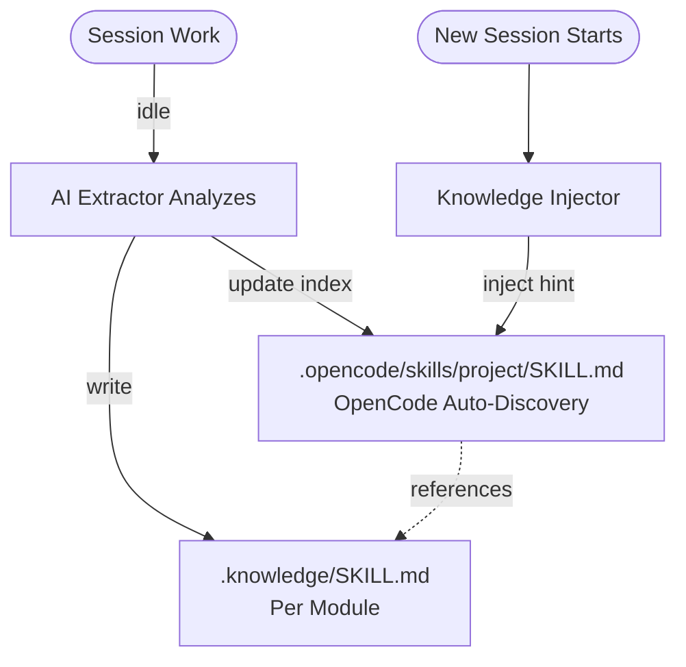

# Smart-Codebase

[English](README.md) | [简体中文](README.zh-cn.md)

> **Turn your OpenCode into a senior project expert that learns and grows with every task.**

---

## 🔥 The Pain Point

Every time you start a new session, AI starts from scratch. It doesn't remember:
- Why you chose that architecture?
- What gotchas exist in your codebase?
- What patterns your team follows?
- What you learned from debugging that nasty bug?

**You explain the same things over and over.**

## ✨ The Solution

smart-codebase automatically captures knowledge from your sessions and makes it available to future sessions.



---

## 📖 Table of Contents

- [⚙️ How It Works](#️-how-it-works)
- [📦 Installation](#-installation)
- [⚡ Commands](#-commands)
- [⚙️ Configuration](#️-configuration)
- [📁 File Structure](#-file-structure)
- [📊 Usage Statistics](#-usage-statistics)
- [🧹 Cleanup Command](#-cleanup-command)
- [🛠️ Development](#️-development)

---

## ⚙️ How It Works

1. **You work normally** - Edit files, debug issues, make decisions
2. **Session goes idle** - After 60 seconds of inactivity, toast notification appears
3. **You can interrupt** - Send a message to cancel extraction and continue working
4. **Extractor analyzes** - AI examines what changed and why (with progress notifications)
5. **Knowledge captured** - Stored in `.opencode/skills/<project>/modules/<module>.md`
6. **Index updated** - Global index at `.opencode/skills/<project>/SKILL.md`
7. **Next session starts** - AI reads project skill, then discovers relevant module skills

**The plugin works silently in the background. Toast notifications keep you informed without interrupting your flow.**

---

## 📦 Installation

Navigate to `~/.config/opencode` directory:

```bash
# Using bun
bun add smart-codebase

# Or using npm
npm install smart-codebase
```

Add to your `opencode.json`:

```json
{
  "plugin": ["smart-codebase"]
}
```

---

## ⚡ Commands

| Command | Description |
|---------|-------------|
| `/sc-status` | Show knowledge base status and usage statistics |
| `/sc-extract` | Manually trigger knowledge extraction |
| `/sc-rebuild-index` | Rebuild `.knowledge/KNOWLEDGE.md` from all SKILL.md files |
| `/sc-cleanup` | Clean up low-usage SKILL files (preview mode) |
| `/sc-cleanup --confirm` | Actually delete low-usage SKILL files |

---

## ⚙️ Configuration

No configuration required by default. To customize, create `~/.config/opencode/smart-codebase.json` (or `.jsonc`):

```jsonc
{
  "enabled": true,
  "debounceMs": 30000,
  "autoExtract": true,
  "autoInject": true,
  "extractionModel": "minimax/MiniMax-M2.1",
  "disabledCommands": ["sc-rebuild-index"]
}
```

#### Project-Specific Configuration (Optional)

To ensure consistent project naming across different environments or Git worktrees, you can create a `.opencode/smart-codebase.json` (or `.jsonc`) file in your **project root** directory:

```jsonc
{
  "projectName": "my-awesome-project"
}
```

| Option | Description |
|--------|-------------|
| `projectName` | Explicitly define the project name for knowledge storage. Useful for Git worktrees where directory names might vary. |
| `name` | Alias for `projectName`. |

---

| Option | Default | Description |
|--------|---------|-------------|
| `enabled` | `true` | Enable/disable the plugin entirely |
| `debounceMs` | `60000` | Wait time (ms) after session idle before extraction |
| `autoExtract` | `true` | Automatically extract knowledge on idle |
| `autoInject` | `true` | Inject knowledge hint at session start |
| `extractionModel` | - | Model for extraction, format: `providerID/modelID` |
| `extractionMaxTokens` | `8000` | Max token budget for extraction context |
| `disabledCommands` | `[]` | Commands to disable, e.g. `["sc-rebuild-index"]` |
| `cleanupThresholds` | See below | Thresholds for cleanup command |

#### cleanupThresholds

| Option | Default | Description |
|--------|---------|-------------|
| `cleanupThresholds.minAgeDays` | `60` | Minimum age in days for cleanup eligibility |
| `cleanupThresholds.minAccessCount` | `5` | Maximum access count for cleanup eligibility |
| `cleanupThresholds.maxInactiveDays` | `60` | Maximum days since last access for cleanup eligibility |

---

## 📁 File Structure Example

```
project/
├── .opencode/
│   └── skills/
│       └── <project-name>/
│           ├── SKILL.md          # Project skill (main index)
│           └── modules/
│               ├── src-auth.md   # Auth module knowledge
│               └── src-api.md    # API module knowledge
│
├── src/
│   ├── auth/
│   │   ├── session.ts
│   │   └── jwt.ts
│   │
│   └── api/
│       └── routes.ts
```

The project skill at `.opencode/skills/<project>/SKILL.md` serves as the global index and is auto-discovered by OpenCode. Module-level knowledge is stored in `.opencode/skills/<project>/modules/<module-name>.md`.

---

### Usage Statistics

The `/sc-status` command now displays:
- Total SKILL count
- Total access count across all SKILLs
- Low-frequency SKILL count (based on cleanupThresholds)
- Usage breakdown (high/medium/low)

Example output:
```
📊 Usage Statistics:
Total SKILLs: 15
Total accesses: 234
Low-frequency SKILLs (< 5 accesses): 3

Usage breakdown:
  - High usage (≥10 accesses): 8 SKILLs
  - Medium usage (5-10): 4 SKILLs
  - Low usage (<5): 3 SKILLs
```

---

### Cleanup Command

Remove low-usage SKILL files based on configurable thresholds.

**Preview mode (default)**:
```bash
/sc-cleanup
```

Lists eligible SKILLs without deleting them.

**Confirm mode**:
```bash
/sc-cleanup --confirm
```

Actually deletes files and updates the main index.

**Cleanup Criteria (AND logic)**:
A SKILL is eligible for cleanup when ALL conditions are met:
1. Age ≥ `minAgeDays` (default: 60 days)
2. Access count < `minAccessCount` (default: 5)
3. Days since last access ≥ `maxInactiveDays` (default: 60 days)

---

## 🛠️ Development

```bash
# Install dependencies
bun install

# Build
bun run build

# Type check
bun run typecheck
```

---

## 📄 License

[Apache-2.0](LICENSE)
